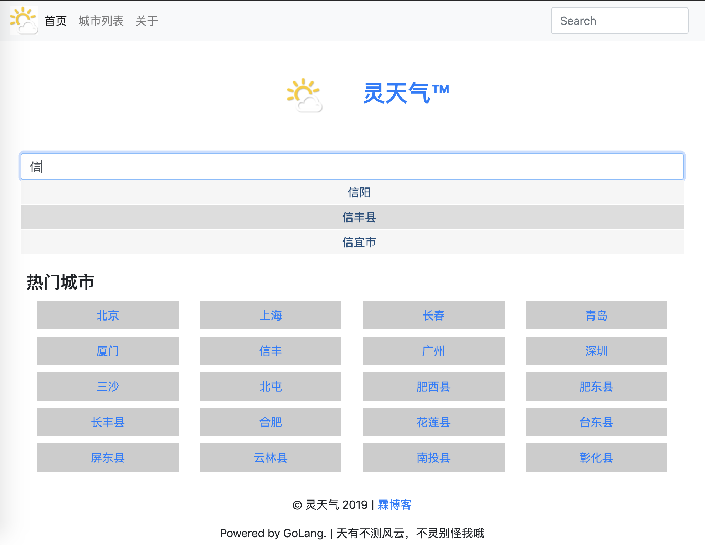
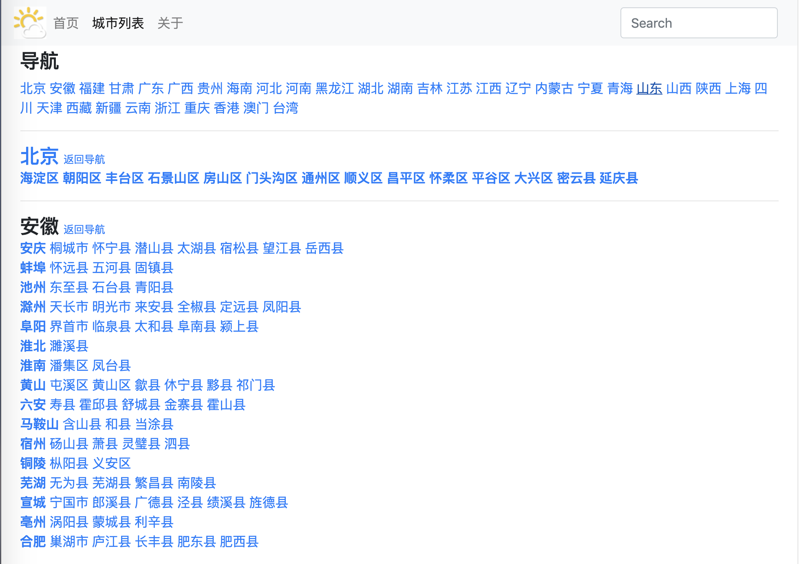
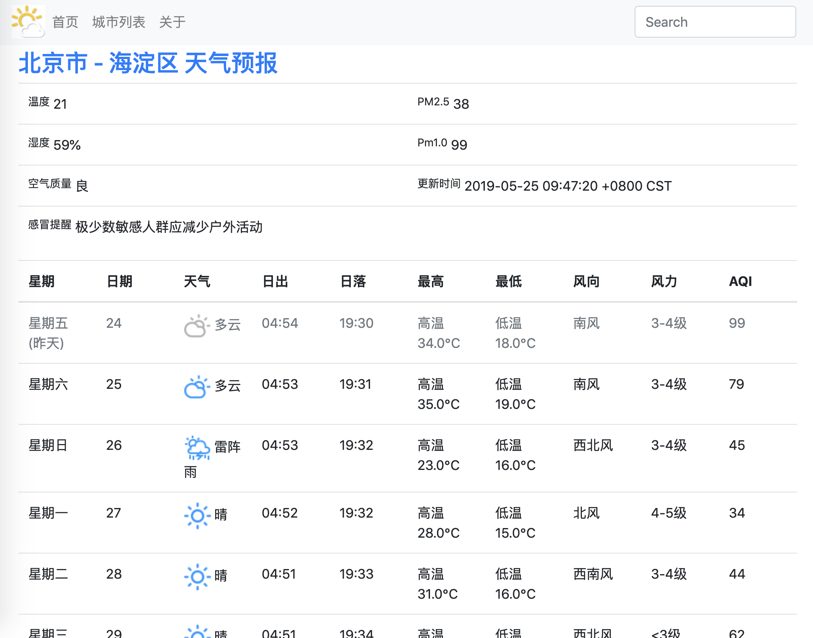
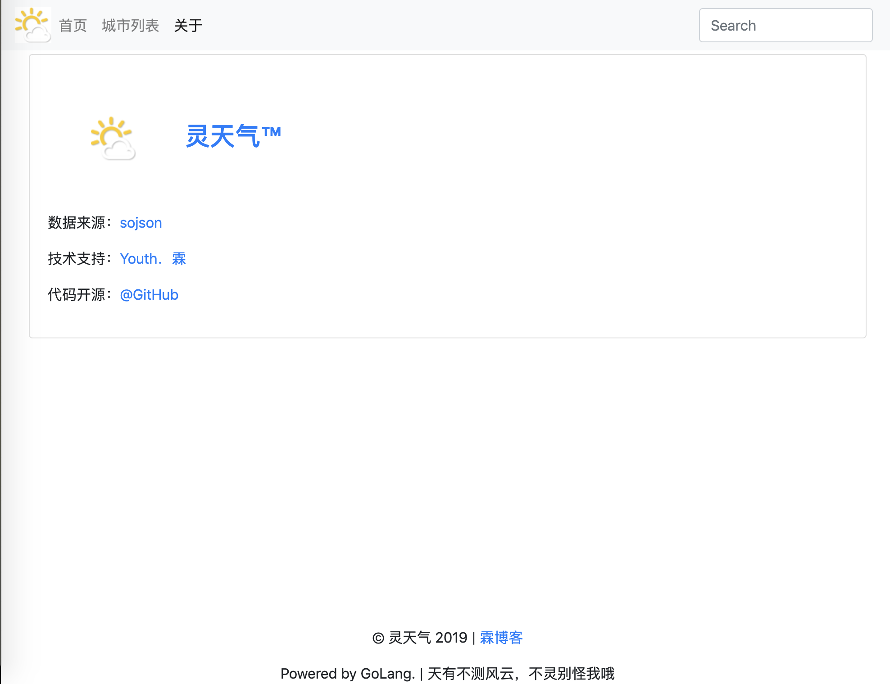

# example-beego 
## Weather Forecast
```
go get github.com/youthlin/examples/example-beego
cd $GOPATH/src/github.com/youthlin/examples/example-beego
vim conf/app.conf
```
修改 `app.conf` 中数据库用户名、密码和数据库
```
go clean
go build
./example-beego
```
打开浏览器 端口 8888

免费天气 API: https://www.sojson.com/blog/305.html

Screen shot:  
首页  
  
城市列表  
  
天气预报 
  
关于  
  

<small>部分代码来自旧仓库 https://github.com/YouthLin/Weather</small>
