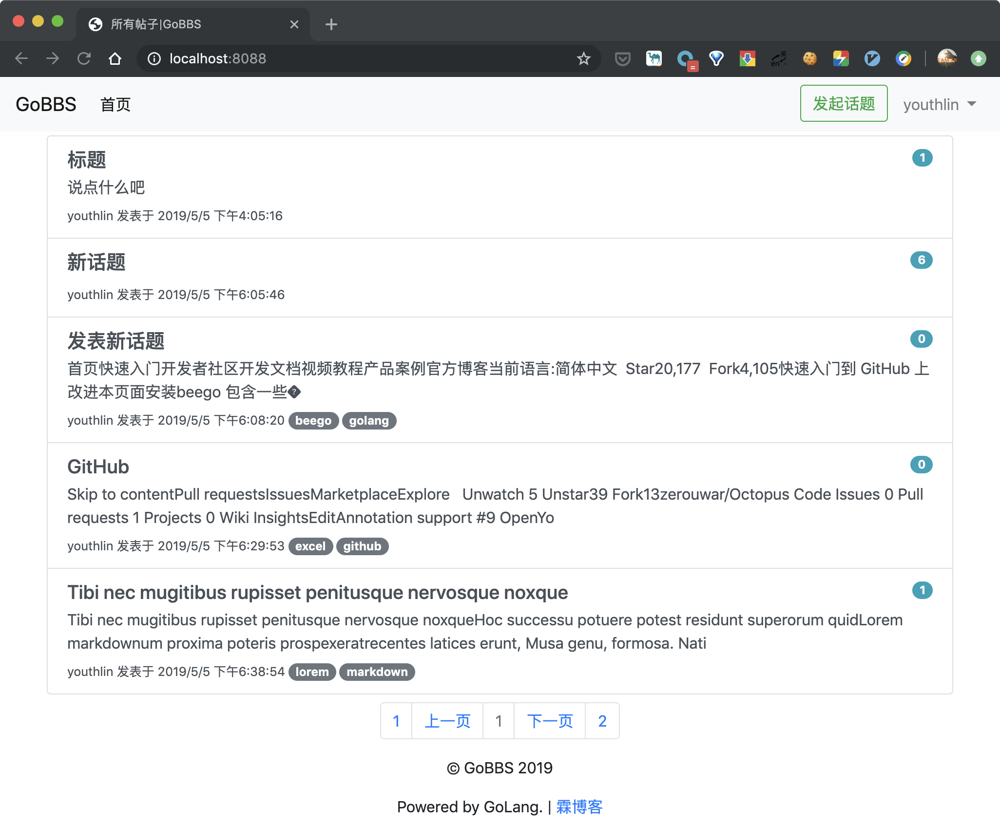
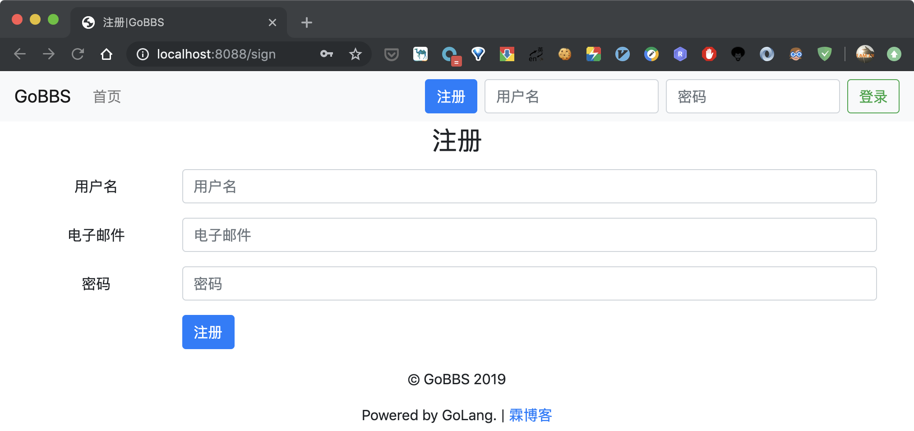
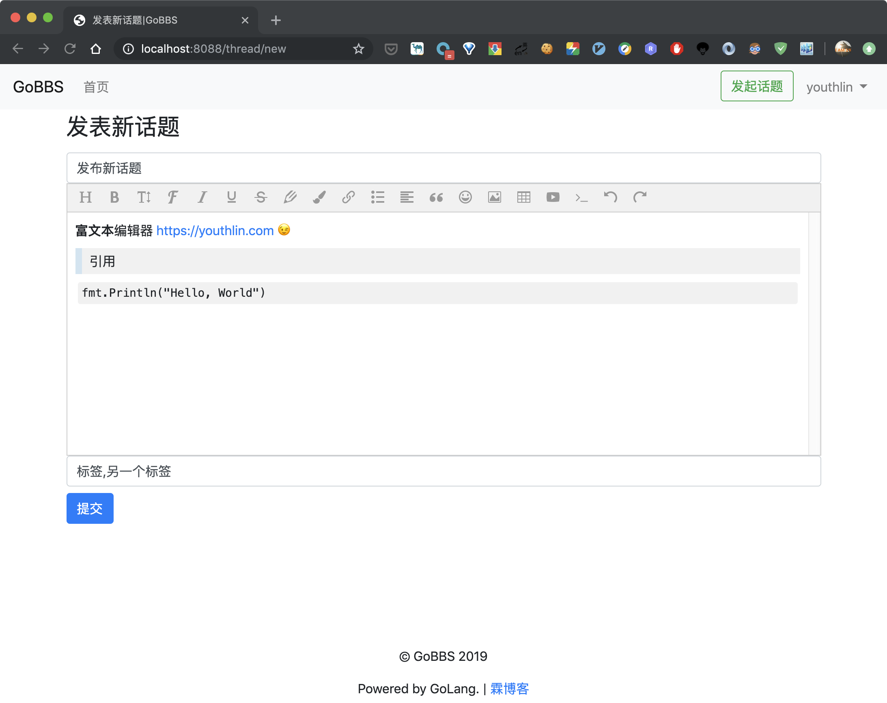
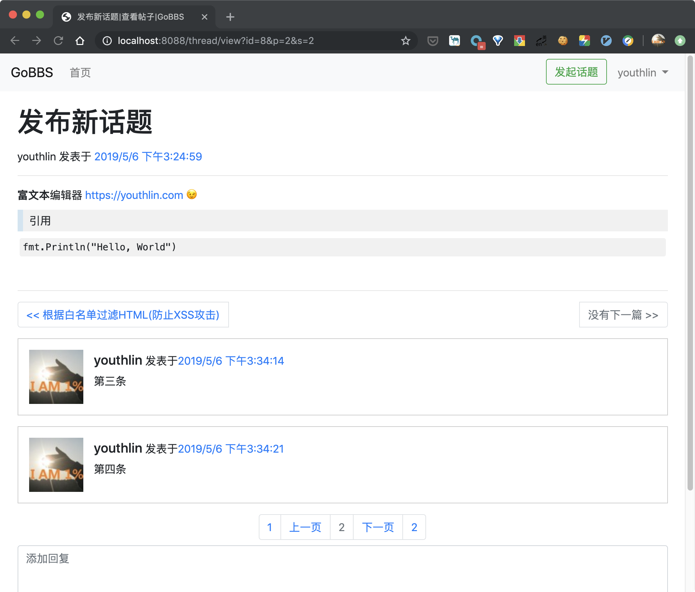
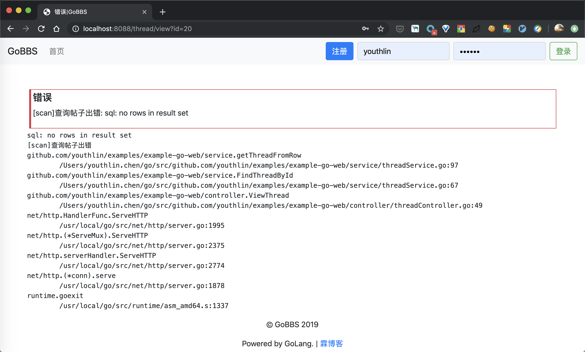

# Example-Go-Web
run this demo:  
```
go get github.com/youthlin/examples/example-go-web
cd $GOPATH/src/github.com/youthlin/examples/example-go-web/
go clean
go build
./example-go-web
```
files:  
```
$GOPATH/src/github.com/youthlin/examples/example-go-web/
├── README.md
├── controller
│   ├── controller.go
│   ├── postController.go
│   ├── threadController.go
│   └── userController.go
├── data
│   ├── model.go
│   └── setup.sql
├── main.go
├── service
│   ├── postService.go
│   ├── threadService.go
│   └── userService.go
├── static
│   ├── css/...
│   ├── fonts/...
│   ├── img/...
│   └── js/...
├── templates
│   ├── error.html
│   ├── layout.html
│   ├── sign-up.html
│   ├── thread-detail.html
│   ├── thread-list.html
│   └── thread-new.html
└── util
    └── util.go

10 directories, 36 files
```
screenshots:  
list:  
  
sign-up:  
  
new:  
  
view:  
  
error-page:  
  
