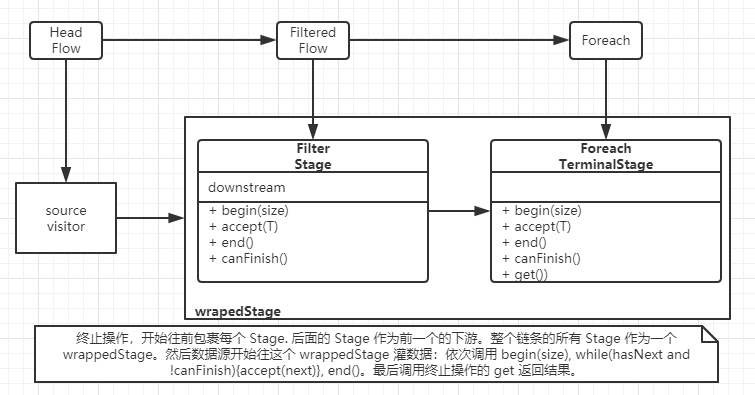

# 自己实现 Java8 的 Stream 流(串行版)
```
List<Integer> list = Lists.newArrayList(1, 2, 3, 4, 5, 6, 7, 8, 8, 8, 9, 9, 9, 1, 2, 3, 2, 3, 4);
String[] strings = Flow.of(list)
        .filter(x -> x % 2 == 0)
        .map(x -> x + "s")
        .limit(30)
        .skip(1)
        .distinct()
        .sorted(Comparator.reverseOrder())
        .toArray(String[]::new);
///[8s, 6s, 4s, 2s]
System.out.println(Arrays.toString(strings));
```

## 对应 Java8 的类
| new class | java8 class| mean |
|-----------|------------|------|
|   `Flow`  |  `Stream`  |  流   |
| `Visitor` |`Spliterator`| 迭代器 多了个获取数量的方法 |
|  `Stage`  |   `Sink`   | 表示一次操作 分为 begin/accept/end 三步 |
 

## 创建流 `Flow`
- `Flow.of(Collection<E>)`  
   从集合创建流
- `Flow.of(Visitor<E>)`  
   从自定义迭代器(`Iterator` 的子接口)创建流
- `Flow.of(E...)`  
   从数组创建流
- `Flow.of(E)`  
   创建包含单个元素的流
- `Flow.empty()`  
   创建空的流
- `Flow.iterate(E seed, UnaryOperator<E> f)`  
   以 seed 为种子，f 为迭代器创建流
- `Flow.generate(Supplier s)`  
   以 s 为数据源创建流

## API 使用
无状态操作
- filter
- map
- flatMap
- peek

有状态操作
- distinct
- sorted
- limit
- skip

终止操作
- forEach
- toArray
- reduce
- collect
- count
- anyMatch
- findFirst

## 实现细节
`AbstractFlow<S, T> implements Flow<T>` 是实现类。
每个无状态操作或有状态操作都不实际执行那个操作，
而是记录当前要执行的动作，然后返回一个新的流，
在终止操作调用时，再一次性遍历数据源，依次执行所有操作。

实现过程

先了解下 Java8 的 `ReferencePipeline`, `Sink`, `java.util.stream.AbstractPipeline.wrapAndCopyInto`
尝试写出 `filter`, `foreach` 的方法体
```
    public Flow<T> filter(Predicate<? super T> predicate) {
        Objects.requireNonNull(predicate);
        return new AbstractFlow<T, T>(this) {
            @Override
            Stage<T> wrapDownstream(Stage<T> nextStage) {
               //?
            }

        };
    }
```
`wrapDownstream` 对应 `java.util.stream.AbstractPipeline.opWrapSink`.  
`Stage` 对应 `Sink` 表示一个要执行的动作。包含三个方法
- `begin(long size)` 操作开始，预计有 size 个元素(未知时为 -1)，如 toArray 操作可以预先准备指定大小的数组容器
- `accept(T)` 接收每个元素时调用
- `end()` 遍历结束
- `canFinish()` 是否可以提前结束遍历

如何将每个动作串起来：通过 downstream 这个表示下游操作的变量 —— 每个 Stage 将自己的动作执行完后，调用下游动作的相应方法。
  
终止方法调用时，才会开始遍历，看下终止方法：
```
    @Override
    public void forEach(Consumer<? super T> action) {
        Objects.requireNonNull(action);
        terminal(new AbstractTerminal<T, Void>(this) {...});
    }
    
    /**
     * 终止方法
     *
     * @param <R>           返回类型
     * @param terminalStage 终止操作
     */
    private <R> R terminal(Stage.TerminalStage<T, R> terminalStage) {
        return terminalStage.startAndGet(source);
    }
    
    /**
     * 终止操作的基类
     *
     * @param <T> 流中元素类型
     * @param <R> 该终止操作的返回类型 通过 {@link Supplier#get()} 返回结果
     * @see Supplier#get()
     */
    static abstract class AbstractTerminal<T, R> implements Stage.TerminalStage<T, R>, Supplier<R> {
        private AbstractFlow<?, T> lastFlow;
        //...
        @Override
        public R startAndGet(Visitor<?> in) {
            lastFlow.start(in, this);
            return get();
        }
    }
    
    /**
     * 开始执行整串流各阶段的操作
     *
     * @param <S_IN> 源迭代器的元素类型
     */
    private <S_IN> void start(Visitor<S_IN> in, Stage.TerminalStage<T, ?> terminalStage) {
        Stage<S_IN> stage = wrapStage(terminalStage);
        stage.begin(in.getSizeIfKnown());
        while (in.hasNext() && !stage.canFinish()) {
            stage.accept(in.next());
        }
        stage.end();
    }
    
    /**
     * 将每个阶段的操作串起来 真正开始处理流时调用
     *
     * @param stage  最后一个操作
     * @param <S_IN> 源迭代器的元素类型
     * @return 将整个串的每个操作串起来作为一个操作
     */
    @SuppressWarnings("unchecked")
    private <S_IN> Stage<S_IN> wrapStage(Stage<T> stage) {
        for (AbstractFlow flow = this; flow.prev != null; flow = flow.prev) {
            /* flow.prev != null 即头节点不参与*/
            stage = flow.wrapDownstream(stage);
        }
        return (Stage<S_IN>) stage;
    }            
```
解释

在终止方法调用时，也有一个 `TerminalStage` 表示终止操作，
TerminalStage 比 Stage 多了个 `startAndGet` 方法，该方法表示开始遍历数据源，并返回最终结果。
分为两步，将整个动作串一次执行(`start()`)，取结果(`get()`)。

start 中首先将每个阶段的动作都包裹起来，
从终止操作的 TerminalStage 开始，
作为前一个阶段的下游依次往前包裹每个 Stage
即 `wrapStage` 和 每次需要重写的 `wrapDownstream` 方法。
然后调用包裹了所有操作的 stage 的 begin/accept/end 方法，执行整串动作。

遍历结束后，返回终止操作的结果 `get()` 即完成。

看下具体 filter 的实现：
```
    public Flow<T> filter(Predicate<? super T> predicate) {
        Objects.requireNonNull(predicate);
        return new AbstractFlow<T, T>(this) {
            @Override
            Stage<T> wrapDownstream(Stage<T> nextStage) {
                return new Stage.AbstractChainedStage<T, T>(nextStage) {
                    @Override
                    public void begin(long size) {
                        /*因为过滤后数量可能改变 所以是不确定个数*/
                        downstream.begin(Visitor.UNKNOWN_SIZE);
                    }

                    @Override
                    public void accept(T element) {
                        if (predicate.test(element)) {
                            downstream.accept(element);
                        }
                    }
                };
            }
        };
    }
```
直接返回一个新的流，包裹下游的方法实现为，
begin 方法通知下游元素个数不确定，
accept 方法先过一遍 foreach 传入的测试条件，符合条件才往下游发送。
end 方法没有重写，由于该操作不是短路操作 canFinish 也没有重写。

终止操作，看一个 foreach：
```
    @Override
    public void forEach(Consumer<? super T> action) {
        Objects.requireNonNull(action);
        // 遍历不需要返回内容所以是 Void
        terminal(new AbstractTerminal<T, Void>(this) {
            @Override
            public Void get() {
                return null;
            }

            @Override
            public void accept(T element) {
                action.accept(element);
            }
        });
    }
```
foreach 处于操作串的最下游，
accept 方法直接调用传入的 Consumer 对每个元素进行消费
(正是 foreach 的语义)。
该操作不需要返回内容，所以 get() 放回 null，

## 还不理解？
```
Flow.of(list)
        .filter(x -> x % 2 == 0)
        .foreach(System.out::pringln);
```



你也可以在 IDEA 中从 `terminal` 方法开始打断点，
代码中每个返回的抽象类都重写了 toString 方法，
有助于 debug 区分各个类。
